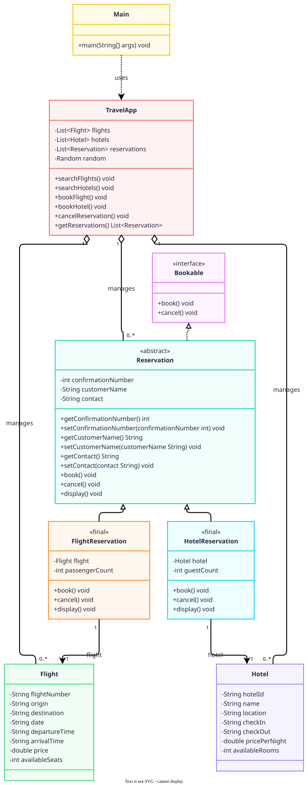

# Travel Booking System

A console-based travel booking system developed in Java for the COSC6047 Introduction to Programming for Business assignment.

The system provides basic flight and hotel booking features. Users can search available options, select an option from the search results, make a reservation, view reservations, and cancel a reservation.

## Features

- Search flights by origin, destination, date, and passenger count
- Search hotels by location, check-in date, check-out date, and guest count
- Select a flight or hotel directly from the search results
- Book flights and hotels
- Generate a unique 6-digit confirmation number
- View current reservations
- Cancel reservations using the confirmation number
- Validate user input
- Handle invalid reservation numbers with a custom exception

## OOP Design

The project uses the following Java concepts:

- Encapsulation through private fields and getter/setter methods
- Inheritance through FlightReservation and HotelReservation
- Polymorphism through the Reservation type
- Abstract class through the Reservation base class
- Interface through the Bookable interface
- Sealed class through the Reservation class
- Final classes for FlightReservation and HotelReservation
- Collections using ArrayList and List
- Lambda expressions and Stream API for searching and filtering
- Pattern matching with instanceof during reservation cancellation
- Exception handling with ReservationNotFoundException

## Class Structure

The main classes are:

- Flight: stores flight information and available seats
- Hotel: stores hotel information and available rooms
- Reservation: abstract base class for reservations
- FlightReservation: represents a flight reservation
- HotelReservation: represents a hotel reservation
- Bookable: defines the book and cancel operations
- TravelApp: manages flight, hotel, and reservation data and contains the main booking logic
- ReservationNotFoundException: handles cancellation requests for unknown reservations
- Main: provides the console menu and handles user input

## UML Class Diagram

The UML class diagram below shows the main Java classes, interface implementation, inheritance, and relationships used in the Travel Booking System.

## Project Structure

    TravelBookingSystem-Java/
    |
    +-- src/
    |   +-- Main.java
    |   +-- TravelApp.java
    |   +-- Flight.java
    |   +-- Hotel.java
    |   +-- Reservation.java
    |   +-- FlightReservation.java
    |   +-- HotelReservation.java
    |   +-- Bookable.java
    |   +-- ReservationNotFoundException.java
    |
    +-- test/
    |   +-- TravelAppTest.java
    |
    +-- docs/
    |   +-- uml.svg
    |
    +-- .github/
    |   +-- workflows/
    |       +-- java-ci.yml
    |
    +-- README.md

## Requirements

- Java 17 or later
- Git

The project uses Java 17 features such as sealed classes and pattern matching with instanceof.

## How to Run

Clone the repository:

    git clone https://github.com/Vian05/TravelBookingSystem-Java.git

Move into the project directory:

    cd TravelBookingSystem-Java

Compile the source files:

    mkdir -p out
    javac -d out src/*.java

Run the application:

    java -cp out Main

## Example Flow

A typical booking flow is:

    1. Search Flights
    2. Enter origin, destination, date, and passenger count
    3. Select a flight from the search results
    4. Enter passenger name and contact
    5. Receive a confirmation number
    6. View the reservation or cancel it later

The hotel booking flow follows the same process using location, check-in date, check-out date, and guest count.

## Testing

### Automated Testing

The project includes a Java test class in test/TravelAppTest.java.

The test covers:

- Flight search
- Hotel search
- Flight booking
- Hotel booking
- 6-digit confirmation numbers
- Seat and room availability changes
- Reservation cancellation
- Restoration of seats and rooms after cancellation
- ReservationNotFoundException

GitHub Actions is configured to compile the source code and run the test using Java 17.

To run the test locally:

    mkdir -p out
    javac -d out src/*.java test/TravelAppTest.java
    java -cp out TravelAppTest

Expected result:

    All TravelApp tests passed.

### Manual Testing

Manual testing was also performed using the console application.

The tested cases include:

- Successful flight search
- Successful hotel search
- Selecting a flight from search results
- Selecting a hotel from search results
- Successful flight booking
- Successful hotel booking
- Viewing reservations
- Successful reservation cancellation
- Search with no available results
- Booking with insufficient seats
- Cancellation with an invalid confirmation number
- Invalid menu input

## Notes

This project uses sample flight and hotel data stored in the application. It does not use an external database or booking API.
